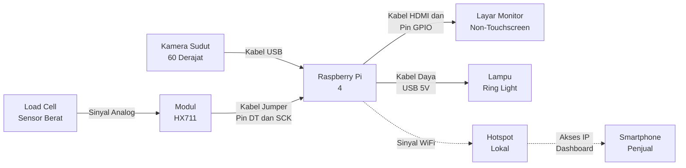

# Diagram Rangkaian Alat DICA (Hardware & Wiring)

Berikut adalah skema koneksi perangkat keras untuk merakit alat kasir pintar DICA. Diagram ini sangat cocok untuk dilampirkan pada bab "Perancangan Sistem" atau "Arsitektur Perangkat Keras" di proposal/skripsi Anda.

### Penjelasan Koneksi (Untuk ditambahkan di Proposal):
1. **Kamera & Vision:** Dua buah kamera terhubung langsung menggunakan kabel USB ke *port* USB 3.0 milik Raspberry Pi untuk transfer gambar secara cepat (bebas *lag*).
2. **Sensor Timbangan:** Kepingan aluminium (Load Cell) mendeteksi beban mekanis dan meneruskannya ke modul amplifier HX711. Modul HX711 berfungsi menerjemahkan sinyal listrik menjadi angka digital dan terhubung ke pin GPIO (Jarum) di Raspberry Pi.
3. **Display:** Raspberry Pi menyalurkan antarmuka kasir ke layar monitor/LCD melalui kabel HDMI.
4. **Jaringan Privat:** Raspberry Pi memancarkan sinyal *hotspot* mandiri. *Smartphone* penjual cukup tersambung ke WiFi tersebut dan mengetikkan IP lokal (misal: `192.168.0.105:5000`) di *browser* untuk memantau kasir dari jauh tanpa memerlukan koneksi internet/kuota.
