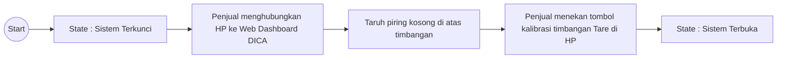
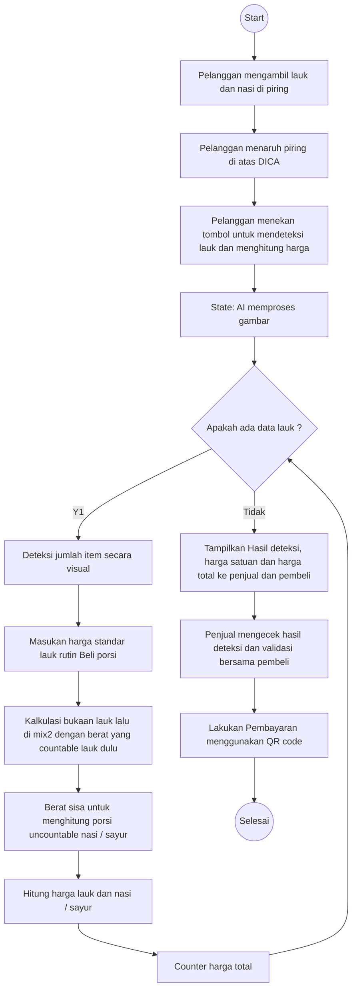

# Analisis Fungsional

Berikut adalah diagram alir (*flowchart*) fungsional dari sistem DICA yang telah disesuaikan dengan format desain yang Anda berikan.

### Diagram 1. Alur Kalibrasi Cold Start

---

### Diagram 2. Alur Transaksi

