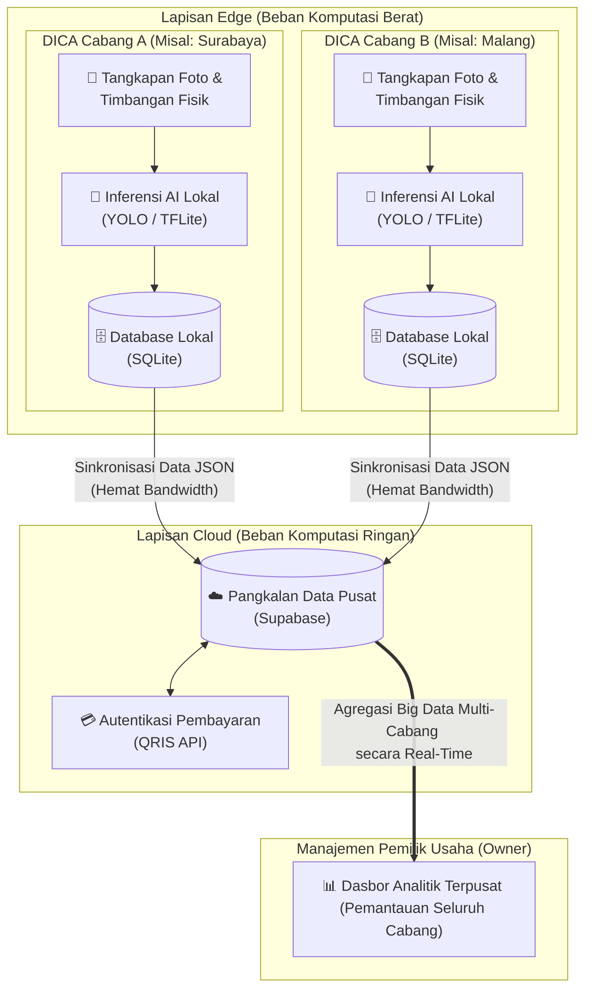

# Arsitektur Terdistribusi DICA (Edge-to-Cloud)

Dokumen ini menjelaskan topologi Komputasi Terdistribusi *Edge-to-Cloud* yang diimplementasikan pada sistem DICA (*Dish Counter Apparatus*).

## Diagram Alur

## Cara Kerja Implementasi Terdistribusi (Manajemen Skalabilitas Multi-Cabang)

Untuk memastikan DICA siap diimplementasikan secara komersial dalam skala besar tanpa menyebabkan kelebihan beban (*bottleneck*) pada jaringan internet UMKM, sistem ini dibangun menggunakan topologi Komputasi Terdistribusi *Edge-to-Cloud*. Melalui arsitektur ini, beban kerja sistem dipisahkan ke dalam dua lapisan utama:

1. **Lapisan *Edge* (Perangkat Lokal di Cabang):** Bertanggung jawab secara eksklusif atas beban komputasi berat (*Heavy Compute*) seperti akuisisi citra statis (pengambilan foto), pra-pemrosesan piksel, inferensi AI (TFLite/YOLO), dan kendali aktuator (printer/timbangan). Setiap mesin DICA beroperasi secara otonom di lokasi masing-masing cabang.
2. **Lapisan *Cloud* (Server Pusat/Supabase):** Bertanggung jawab atas beban analitik ringan (*Light Compute*), agregasi data penjualan dari seluruh cabang, manajemen autentikasi QRIS, dan penyajian *Dashboard* pemantauan untuk pemilik usaha.

Dengan pemisahan logika terdistribusi ini, latensi deteksi di meja kasir dapat ditekan hingga di bawah 1 detik tanpa menyumbat *bandwidth* internet warteg. Hal ini dikarenakan setelah transaksi selesai, mesin *Edge* hanya mengirimkan *payload* data transaksi berukuran kilobyte (berupa *string* JSON hasil rekap inferensi), bukan mengunggah *file* foto beresolusi tinggi ke server.

Keunggulan utama dari implementasi desentralisasi ini adalah kemampuannya menampung ratusan mesin DICA di bawah satu ekosistem pangkalan data terpusat (*Centralized Cloud Database*). Seluruh data transaksi dari berbagai cabang geografis (misalnya: Cabang A di Surabaya, Cabang B di Malang) akan diagregasi secara *real-time*. Hasilnya, pemilik usaha waralaba dapat memantau performa penjualan, ketersediaan lauk, dan pola konsumsi pelanggan dari seluruh cabangnya melalui satu antarmuka dasbor analitik tunggal. Topologi ini tidak hanya menciptakan ekosistem perangkat cerdas yang efisien, tetapi juga memberikan landasan *Big Data* yang krusial untuk pemantauan ekonomi dan ketahanan pangan tingkat akar rumput.
