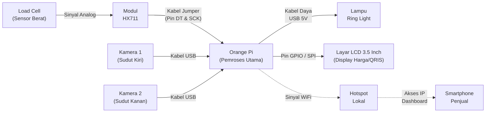

# Arsitektur Perangkat Keras DICA (Hardware Architecture)

Dokumen ini menguraikan topologi dan koneksi perangkat keras (hardware) yang digunakan dalam sistem DICA (*Dish Counter Apparatus*).

## Diagram Alur Perangkat Keras

## Deskripsi Komponen

1. **Pemroses Utama:** Menggunakan **Orange Pi** (SBC) yang berperan sebagai otak komputasi untuk mengeksekusi model *Artificial Intelligence* (YOLO/TFLite) secara lokal di *Edge*.
2. **Kamera Ganda:** Dua buah kamera USB yang digunakan untuk meminimalkan *blind spot* atau oklusi (makanan saling menumpuk/menutupi).
3. **Sensor Fisik:** *Load cell* yang dihubungkan melalui modul konverter ADC HX711 untuk memberikan umpan balik (validasi stabilitas piring dan berat).
4. **Display:** Menggunakan layar **LCD 3.5 Inch** via GPIO/SPI untuk menampilkan harga total dan kode QRIS kepada pelanggan dengan ringkas dan elegan, menghilangkan ketergantungan pada monitor besar.
5. **Jaringan:** Alat terkoneksi via WiFi Hotspot ke *Smartphone* penjual untuk memonitor dasbor web lokal.
