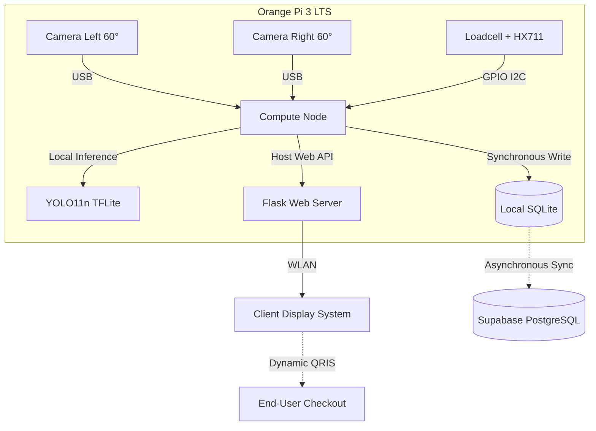
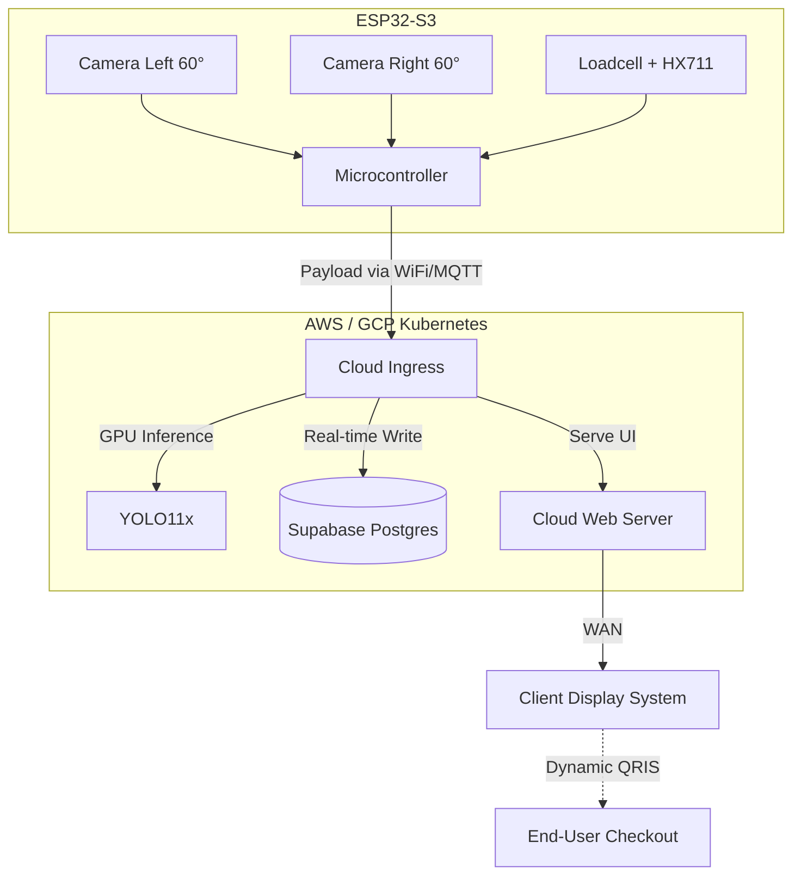

# DICA Technical Stack & Architecture Trade-offs
*Document Prepared for GEMASTIK 2026 (Piranti Cerdas, Sistem Benam & IoT)*

This document outlines two architectural paradigms currently under evaluation. Both scenarios are documented with their respective structural dependencies and trade-off analyses pending final managerial review.

## 1. Vision System Configuration (Common to All Scenarios)
**Orthogonal Stereo Vision (60° Left-Right Configuration):**
The optical array utilizes dual 720p USB Webcams positioned orthogonally at a 60-degree angle from the left and right axes of the central focal point. This cross-angular configuration mitigates optical occlusion inherent in unstructured overlapping food arrangements, providing superior depth and volumetric estimation capabilities compared to planar top-down approaches.

## 2. SCENARIO A: Edge AI Architecture (Offline-First)
This paradigm prioritizes operational resilience in high-latency or zero-connectivity environments by executing localized artificial intelligence inference within the edge device.

### Architecture Flow (Scenario A)

**Scenario A Analysis:**
* **Pros:** Complete operational autonomy from external network conditions (Offline-First). Eliminates central server bottlenecks during peak operational hours by decentralizing computation across all edge nodes. Results in near-zero computational cloud overhead (OPEX).
* **Cons:** Higher initial Capital Expenditure (CAPEX) per node (~IDR 1,100,000). Inference capabilities are strictly constrained by the hardware limitations of the ARM-based SBC.

## 3. SCENARIO B: Cloud-Native Architecture (Thin Client SaaS)
This paradigm transitions the local hardware into a rudimentary data-acquisition node (Thin Client), offloading intensive computational workloads and data persistence entirely to cloud-based infrastructure.

### Architecture Flow (Scenario B)

**Scenario B Analysis:**
* **Pros:** Significantly lower initial CAPEX per node (~IDR 400,000), facilitating rapid physical deployment and scalability. Unrestricted inference accuracy utilizing large-scale foundational models (YOLO11x) deployed on cloud GPU clusters.
* **Cons:** Zero fault tolerance for network instability; node failure is guaranteed upon loss of connectivity. Demands highly sophisticated DevOps orchestration (e.g., Kubernetes Horizontal Pod Autoscaling) to mitigate server bottlenecks during concurrent peak usage. Exponentially higher recurring cloud operational expenses (OPEX).

## 4. Comprehensive Software Stack
The following outlines the software and dependency layers utilized across the defined architectures.

### 4.1. Operating System (OS)
* **Edge Environment:** Armbian Linux / Debian 12 (Bookworm) 64-bit, configured in headless mode to maximize memory allocation for inference engines.
* **Cloud Environment:** Ubuntu Server 24.04 LTS.

### 4.2. Runtime & Environment Management
* **Programming Language:** Python 3.10+ (Utilized for backend routing, GPIO integration, and AI inference pipelines).
* **Package Management:** `uv` (Astral), providing high-performance, Rust-based virtual environment isolation and dependency resolution.

### 4.3. Artificial Intelligence & Computer Vision
* **Core Model:** YOLO11 Nano Segmentation (Edge) or YOLO11x (Cloud).
* **Inference Engine (Edge):** TensorFlow Lite (`tflite-runtime`), optimized for CPU-bound ARM architectures.
* **Image Processing:** OpenCV (`cv2`) for visual matrix extraction and discrete dual-frame snapshot capture (event-triggered), completely eliminating continuous video streaming to conserve CPU cycles and network bandwidth.

### 4.4. Backend Web Server & Frontend UX
* **Web Framework:** Flask (Python Micro-framework), operating strictly as a stateless REST API endpoint for discrete snapshot inference, minimizing active concurrent connections.
* **User Interface (CDS):** Vanilla HTML5, CSS3, and JavaScript, designed as a lightweight, static Customer Display System devoid of heavy reactive frameworks.
* **Payment Gateway Integration:** Python `qrcode` and `Pillow` (PIL) libraries for dynamic, on-the-fly QRIS image payload generation via the `/api/qr` endpoint.

### 4.5. Database & Data Persistence
* **Local Persistence (Edge):** SQLite3, maintaining relational transaction integrity locally on the device's eMMC storage.
* **Cloud Persistence (BaaS):** Supabase (PostgreSQL) functioning as the central data warehouse.
* **Hardware Interfacing:** `RPi.GPIO` and `hx711-python` for analog-to-digital (ADC) conversion of loadcell metrics.

### 4.6. Deployment & Version Control
* **VCS:** Git & GitHub.
* **Execution Protocols:** Bash scripting for automated environment initialization and daemon/systemd service configuration.

## 5. System Resilience & Concurrency Model
To ensure enterprise-grade reliability in unpredictable operational environments, the system incorporates advanced fault tolerance, fallback mechanisms, and robust threading architectures.

### 5.1. Fault Tolerance
* **Hardware Redundancy:** The stereo vision array provides inherent fault tolerance; if one USB camera module suffers a hardware failure, the inference pipeline automatically continues operation utilizing the surviving mono-camera feed.
* **Network Isolation (Offline-First):** In the Edge AI configuration (Scenario A), transaction payloads are locally queued in the SQLite database during external network outages. A reconciliation daemon automatically executes bulk upstream synchronization to Supabase upon connectivity restoration, ensuring absolute data integrity.

### 5.2. Fallback Mechanisms
* **Algorithmic Degradation:** Should the YOLO11 inference pipeline return a confidence matrix below the predefined operational threshold (e.g., due to extreme optical glare or novel anomalous objects), the system gracefully degrades into a manual override state. The Web UI immediately prompts the cashier for manual item validation without halting the checkout flow.
* **Payment Gateway Fallback:** In the event of dynamic QRIS payload generation failure or API timeout, the Customer Display System automatically falls back to rendering a statically cached, pre-validated QRIS image to prevent transaction bottlenecks.

### 5.3. Concurrency & CPU Affinity Architecture
* **Non-Blocking Execution:** The Python backend utilizes robust multiprocessing paradigms to completely decouple the stateless Web Server from hardware-blocking operations.
* **CPU Core Pinning (Asymmetric Multiprocessing):** To maximize the Quad-Core Cortex-A53 architecture of the Orange Pi, worker processes are explicitly pinned to specific physical CPU cores (e.g., Core 0: OS & Flask Networking; Core 1 & 2: Dual USB Camera Frame Extraction & Matrix Preprocessing; Core 3: YOLO11 TFLite Tensor Multiplication). This strict hardware isolation guarantees that the Web UI never experiences synchronous freezing, even during maximal inference workloads.
