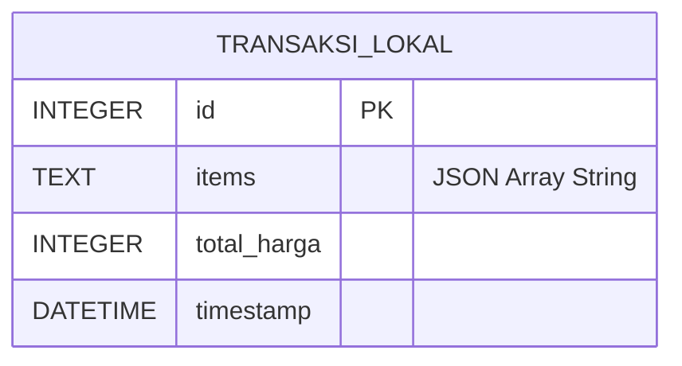
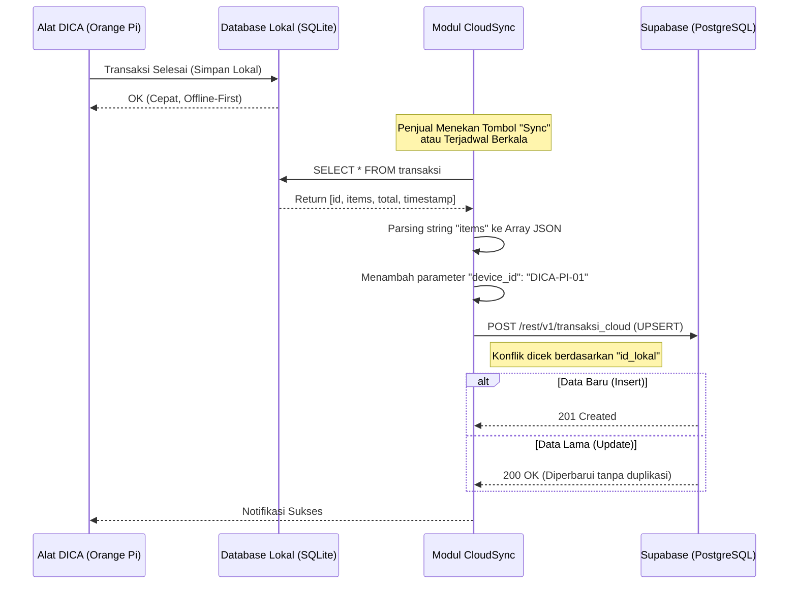

# Arsitektur Database & Cloud Sync DICA

Sistem *Dish Counter Apparatus* (DICA) menggunakan arsitektur database hybrid: **SQLite** sebagai penyimpanan lokal yang cepat untuk *Edge Computing*, dan **Supabase (PostgreSQL)** untuk penyimpanan *cloud* jarak jauh.

## 1. Skema Database Lokal (SQLite)
Database lokal berada di perangkat Raspberry/Orange Pi pada file `data/transaksi.db`.
Tabel utama yang digunakan adalah `transaksi` dengan skema berikut:

| Kolom | Tipe Data | Keterangan |
|-------|-----------|------------|
| `id` | INTEGER PRIMARY KEY AUTOINCREMENT | ID Unik transaksi lokal |
| `items` | TEXT | List lauk yang dibeli dalam format JSON Array (misal: `["nasi_porsi", "ayam_goreng"]`) |
| `total_harga` | INTEGER | Total tagihan transaksi (dalam Rupiah) |
| `timestamp` | DATETIME DEFAULT CURRENT_TIMESTAMP | Waktu transaksi dilakukan secara otomatis dari sistem |

### Diagram Entitas Lokal

## 2. Skema Database Cloud (Supabase / PostgreSQL)
Database cloud berada di Supabase. Sinkronisasi memindahkan data dari tabel `transaksi` lokal ke tabel `transaksi_cloud` di Supabase.

| Kolom | Tipe Data | Keterangan |
|-------|-----------|------------|
| `id_cloud` | BIGINT PRIMARY KEY AUTOINCREMENT | ID Utama di database cloud |
| `id_lokal` | INTEGER UNIQUE | Mengacu pada `id` dari database SQLite lokal (Kunci Upsert) |
| `items` | JSONB | List data menu/lauk |
| `total_harga` | INTEGER | Tagihan |
| `timestamp` | TIMESTAMPTZ | Waktu asli transaksi dari perangkat |
| `device_id` | TEXT | Identitas mesin edge (Saat ini *hardcoded*: `"DICA-PI-01"`) |

## 3. Logika Sinkronisasi (Cloud Sync)
Sinkronisasi dikelola oleh kelas `CloudSync` di file `src/dica/db/cloud_sync.py`.

**Bagaimana sinkronisasi dilakukan?**
1. **Pemicu (Trigger):** Sinkronisasi dapat dipanggil melalui *API endpoint* atau penjadwalan.
2. **Ekstraksi Lokal:** `CloudSync` membaca seluruh baris data (tiap `id`) dari file SQLite lokal.
3. **Format Payload:** Data lokal dibungkus menjadi JSON, di mana nilai `id` lokal dipetakan ke kolom `id_lokal`, tipe array string di-parse menjadi JSON aslinya, dan disematkan asal alat (contoh: `"device_id": "DICA-PI-01"`).
4. **Upsert ke Cloud:** Klien akan memanggil API Supabase dengan metode `upsert` dan konflik berdasarkan kunci `id_lokal` (`on_conflict="id_lokal"`). 
   * **Insert:** Jika `id_lokal` belum ada di Cloud, ia akan membuat baris baru.
   * **Update:** Jika `id_lokal` sudah pernah dikirim sebelumnya, Cloud hanya akan memperbarui nilainya, mencegah adanya entri ganda (*duplication*).

### Diagram Alir Sinkronisasi (Mermaid)

## Kelebihan Arsitektur Ini:
* **Offline-First:** Transaksi tidak pernah terhambat oleh koneksi internet yang lambat, karena disimpan dulu di Raspberry/Orange Pi secara lokal. Waktu *processing* AI tetap di bawah 5 detik.
* **Tidak Ada Data Ganda:** Fitur *UPSERT* Supabase memastikan jika terjadi putus koneksi di tengah jalan, data yang di-*resync* tidak akan tercatat dua kali di laporan kasir *cloud*.
* **Multi-Branch Ready:** Dengan adanya parameter `device_id`, arsitektur database sudah siap untuk menampung transaksi dari beberapa cabang kantin sekaligus.
